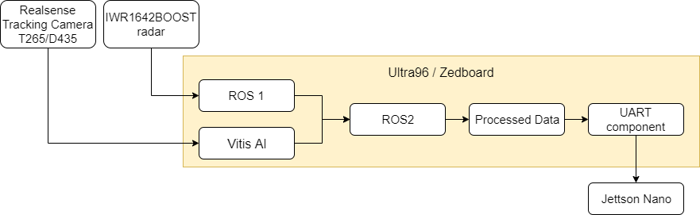
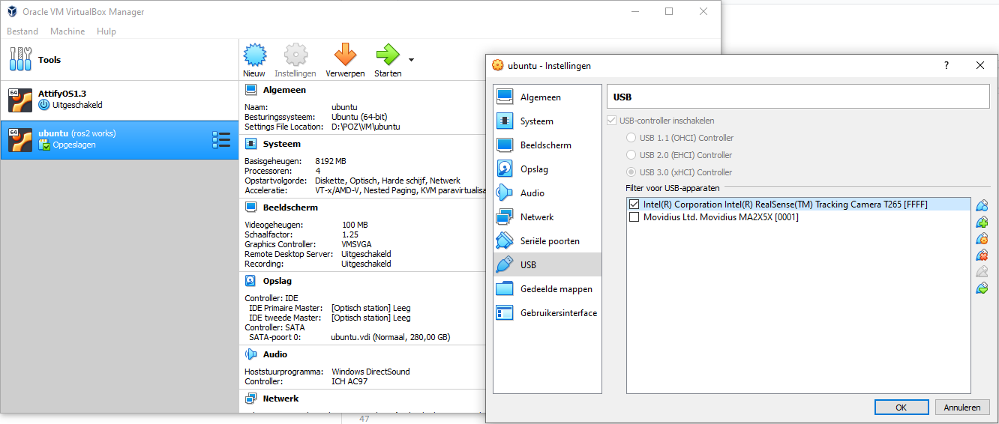
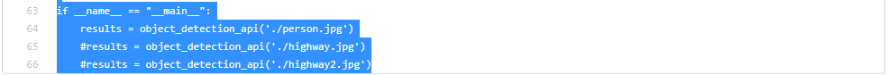

# ADAS_AI_cart
Made by students of [the hogeschool PXL](https://www.pxl.be).

The purpose of this project is to develop an ADAS system for an autonomous golfcart.

A Pytorch resnet50-model and openCV library are used to detect objects captured by the [Intel T265 Realsense Tracking Camera](https://www.intelrealsense.com/tracking-camera-t265/) / [Intel D435 Realsense Camera](https://www.intelrealsense.com/depth-camera-d435/) and the [TI IWR1642 Radar](http://www.ti.com/tool/IWR1642BOOST).

The resulting data is then transmitted to the [Jetson-Nano](https://github.com/KingAbad/Autonomous_Cart_2?fbclid=IwAR21YFBcbC4viqrMCfkstqgnDQ-sq7s7LPgTWAJHs7tx8XUIrGCixJqF12Q) via Json.

The project is programmed on a [Ultra96](http://zedboard.org/product/ultra96-v2-development-board) and/or the [zedboard](http://zedboard.org/product/zedboard). This is done with ROS2/ROS1 and/or U-boot with C-Kernels to make an application and compare them based on efficiency.

## Branches
```
  Documentation                               general documentation and instructions to install     
  zedboard_ros2_errors_solutions              Errors with installing ROS2 and solutions
  zedboard-C-kernels                          C-test kernels for Ubuntu 18.04 bionical
  zedboard-pytorch-resnet50-obj-detection     Resnet50 python programma with images
  zedboard-Uboot                              U-boot files for zedbord
```
## Flowchart
<p align="center"></p>

## Project Goals
<details>
  <summary>Zedboard</summary>
  
  ## Zedboard installation
  these installation steps include:
  * 1 [Intel RealSense Camera T265](https://www.intelrealsense.com/tracking-camera-t265/)
  * 1 [zedboard](http://zedboard.org/product/zedboard)
  * 1 [TI IWR1642](http://www.ti.com/tool/IWR1642BOOST)
  
  **setting up of the VM with ubuntu 18.04**
  * Follow [the video](https://www.youtube.com/watch?v=QbmRXJJKsvs) to set up [the VM with Oracle's VirtualBox](https://www.virtualbox.org/).
  * enable USB3.0 in the settings menu by selecting USB and enable the "USB 3.0 (xHCI) Controller"
  
  <p align="center"></p>
  
  **setting up of the Realsense T265 Camera**
 
 It is recommended to not have anaconda3 installed on your VM since this can create pathing issues and lead to colcon build errors, see the "ros2_errors_and_solutions" to fix these pathing problems without deinstalling anaconda3.
  * follow [the instructions](https://www.intelrealsense.com/sdk-2/) about the installation of SDK 2.0 in linux Ubuntu 18.04.
  * Run realsense-viewer to see if the installation was succesfull.
  * If the Camera is not found between the USB devices, go to the "ros2_errors_and_solutions" branch.
  this happens because the VM's USB3.0 drivers are having trouble finding the Realsense T265 camera.
  
  **setting up ROS2**
  * follow the instructions on [the Ros website](https://index.ros.org/doc/ros2/Installation/Dashing/Linux-Development-Setup/).
    it is recommended to install the ros dependencies ("rosdep" command) of both "building ROS 2 linux" and "installation ROS 2 linux".
  * for colcon building errors go to the "ros2_errors_and_solutions" branch.
  
  **setting up the TI IWR1642 Radar**
  *
  *
  
  **torchVision resnet50 model**
  * type "sudo apt-get install python3 \ python3-pip \ python3-opencv" 
  * type "pip3 install torchvision"
  * download the model on the "zedboard-pytorch-resnet50-obj-detection" branch.
  * type "nano object_detection.py" in de linux terminal to open the python program.
  * scroll to the bottom where a .png image is requested.
  
  <p align="center"></p>
  
  * change the input image to the an .png image of own choice.

  * save and exit nano and run the "object_detection.py".
  
</details>
<details>
  <summary>Ultra96</summary>
  
  ## Ultra96 installation
  these installation steps include:
  * 1 [Intel RealSense Camera D435](https://www.intelrealsense.com/depth-camera-d435/)
  * 1 [Ultra96](http://zedboard.org/product/ultra96-v2-development-board)
  * 1 [TI IWR1642](http://www.ti.com/tool/IWR1642BOOST)
  
  **setting up of the VM with ubuntu 18.04**
  * Follow [the guide](https://www.hackster.io/anujvaishnav20/building-ubuntu-for-ultra96-fpga-c9aefa) to set up the Ubuntu for Ultra96.
  
  <p align="center"></p>
  
  * From here on follow the same steps as discussed in the Zedboard section.

## Materials and software
**Used Software**
* [Python](https://www.python.org/) - used programming language for the model.
* [OpenCV](https://opencv.org/) - used Library for detection visualisation.
* [ROS](https://www.ros.org/) - used tools-library to join Camera and Radar (zedboard).
* [VITIS-AI](https://www.xilinx.com/products/design-tools/vitis/vitis-ai.html) - used ACAP system for Camera and Radar (Ultra96)
* [Oracle's VirtualBox](https://www.virtualbox.org/) - used Virtual Machine to run Linux Ubuntu 18.04 Bionical
* [SDK 2.0](https://github.com/IntelRealSense/librealsense) - Intel Camera driver

**Used Hardware**
* [Intel RealSense Camera T265](https://www.intelrealsense.com/tracking-camera-t265/) - used camera (zedboard).
* [Intel D435 Camera](https://www.intelrealsense.com/depth-camera-d435/) - used camera (ultra96)
* [TI IWR1642](http://www.ti.com/tool/IWR1642BOOST) - used Radar.
* [zedboard](http://zedboard.org/product/zedboard) - used FPGA board
* [Ultra96](http://zedboard.org/product/ultra96-v2-development-board) - used FPGA board

## Authors
* *Vincent Claes*     - Product Owner- [LinkedIn](https://www.linkedin.com/in/vincentclaes/)
* *Bart Stukken*      - Scrum Master- [LinkedIn](https://www.linkedin.com/in/bart-stukken-7a7659b0/)
* *Bart Gripsen*      - Scrum Member- [LinkedIn](linkedin.com/in/bart-grispen-9634b1181)
* *Dennis Merken*     - Scrum Member- [LinkedIn](linkedin.com/in/dennis-merken-93747719b)
* *Jethro Pans*       - Scrum Member- [LinkedIn](https://www.linkedin.com/in/jethro-pans-67518b1a3/)
* *Kris Teuwen*       - Scrum Member- [LinkedIn](https://www.linkedin.com/in/kris-teuwen-7292a4172/)
