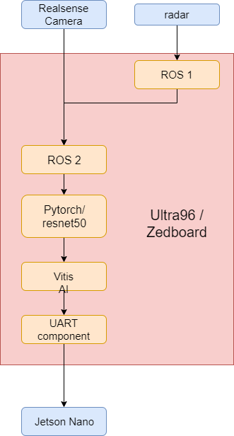

# ADAS_AI_cart
Made by student of [the hogeschool PXL](https://www.pxl.be).

The purpose of this project is to develop an ADAS system for an autonomous golfcart.

A Pytorch resnet50-model and openCV library are used to detect objects captured by the [Intel T265 Realsense Tracking Camera](https://www.intelrealsense.com/tracking-camera-t265/) / [Intel D435 Realsense Camera](https://www.intelrealsense.com/depth-camera-d435/) and the [TI IWR1642 Radar](http://www.ti.com/tool/IWR1642BOOST).

The resulting data is then transmitted to the [Jetson-Nano](https://github.com/KingAbad/Autonomous_Cart_2?fbclid=IwAR21YFBcbC4viqrMCfkstqgnDQ-sq7s7LPgTWAJHs7tx8XUIrGCixJqF12Q) via Json.

The project is programmed on a [Ultra96](http://zedboard.org/product/ultra96-v2-development-board) and/or the [zedboard](http://zedboard.org/product/zedboard). This is done with ROS2/ROS1 and/or U-boot with C-Kernels to make an application and compare them based on efficiency.

## Branches
```
  Documentation                               general documentation and instructions to install     
  zedboard_ros2_errors_solutions              Errors with installing ROS2 and solutions
  zedboard-C-kernels                          C-test kernels for Ubuntu 18.04 bionical
  zedboard-pytorch-resnet50-obj-detection     Resnet50 python programma with images
  zedboard-Uboot                              U-boot files for zedbord
```
## Flowchart
<p align="center"></p>

## Project Goals

## Materials and software

* [Python](https://www.python.org/) - used programming language for the model.
* [OpenCV]() - used Library for detection visualisation.
* [ROS](https://www.ros.org/) - used tools-library to join Camera and Radar (zedboard).
* [VITIS-AI](https://www.xilinx.com/products/design-tools/vitis/vitis-ai.html) - used ACAP system for Camera and Radar (Ultra96)

* [Intel RealSense Camera T265](https://www.intelrealsense.com/tracking-camera-t265/) - used camera (zedboard).
* [Intel D435 Camera](https://www.intelrealsense.com/depth-camera-d435/) - used camera (ultra96)
* [TI IWR1642](http://www.ti.com/tool/IWR1642BOOST) - used Radar.
* [zedboard](http://zedboard.org/product/zedboard) - used FPGA board
* [Ultra96](http://zedboard.org/product/ultra96-v2-development-board) - used FPGA board

## Authors
* *Vincent Claes*     - Product Owner- [LinkedIn](https://www.linkedin.com/in/vincentclaes/)
* *Bart Stukken*      - Scrum Master- [LinkedIn](https://www.linkedin.com/in/bart-stukken-7a7659b0/)
* *Bart Gripsen*      - Scrum Member- [LinkedIn](linkedin.com/in/bart-grispen-9634b1181)
* *Dennis Merken*     - Scrum Member- [LinkedIn](linkedin.com/in/dennis-merken-93747719b)
* *Jethro Pans*       - Scrum Member- [LinkedIn](https://www.linkedin.com/in/jethro-pans-67518b1a3/)
* *Kris Teuwen*       - Scrum Member- [LinkedIn](https://www.linkedin.com/in/kris-teuwen-7292a4172/)
